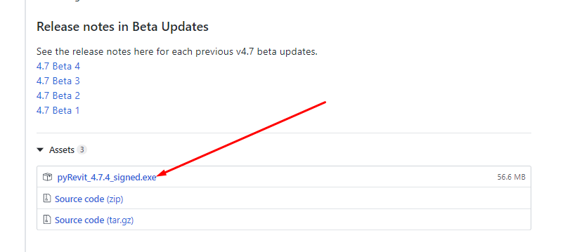
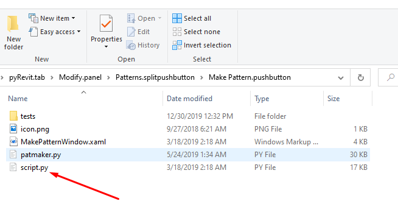
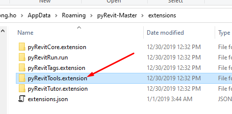
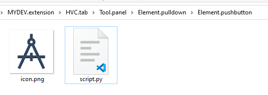
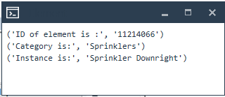

Chào mừng các bác đã ghé thăm blog của mình.😄

 pyRevit là môi trường tạo mẫu ứng dụng nhanh cho Autodesk Revit.Môi trường này giúp mình lên những ý tưởng tự động hóa nhanh chóng như một addin thực thụ với bất kì ngôn ngữ nào mà mình thấy mình làm chủ tốt nhất, khi các bác cài đặt pyRevit cũng sẽ bao gồm các tiện ích **CLI** Để tận dụng lại và tiếp tục tùy chỉnh triển khai tiếp, không phải đập đi xây lại đâu.

 pyRevit có thể làm được : 
 - Thêm một Ribbon tùy chỉnh vào thanh tiện ích trên Revit.
 - Tạo ra các ý tưởng của các bác với vài dòng code một cách nhanh chóng, không phải build phức tạp nữa.
 - Viết Addin riêng với Python(IronPython hoặc CPython), C Sharp, VB.Net
 - Phối hợp được luôn với các công cụ be bé như Dynamo, pyRevit, Grasshopper hợp nhất giao diện.
 - Chia sẻ lên cộng đồng như Github để họ học hỏi hoặc thậm chí là giúp các bác tiếp tục triển khai ý tưởng đó bự hơn, chà bá hơn.

---
### Cài đặt như thế nào 

Đầu tiên các bác muốn cài đặt thì vào trang [này](https://github.com/eirannejad/pyRevit/releases) sau đó tìm xuống tệp có  đuôi .Exe để tải về trước về.Công việc cài đặt cũng chỉ next next như các phần mềm thông thường thế là xong. 😁 



Sau khi cài xong các bác mở Revit lên, nó sẽ yêu cầu một sự kiện thông báo là có muốn load không, như mọi addin khác thì các bác cứ chọn luôn load luôn để lần sau nó khỏi hỏi nhức đầu luôn nhé.


Nếu thành công thì trên thanh Ribbon sẽ có như sau:


Vậy là mình đã hoàn tất xong thao tác cài đặt rối đó 😊, khá là đơn giản phải không các bác.

### Sử dụng và viết mã

Cài rồi thì cũng phải vọc đúng không các bác,nếu mình muốn sử dụng thì cứ để nguyên đó rồi dùng các chức năng trong **Ribbon** đó mà tác giả viết thôi, nhưng nếu bác là người tò mò muốn chọc ngoáy thì không dễ dàng vậy đâu

Để đọc được code trong đó các bác chỉ việc rê đến công cụ mình và giữ `Alt + Click chuột` là sẽ mở ra ngay đường dẫn chứa code của tác giả.



Các bác thấy đó, công sức người khác viết ra đã như vậy rồi, vậy thì công việc của mình chỉ là nhân đôi đường dẫn lên và viết mã thôi.Để làm được điều đó thì mình sẽ **Copy** từ chỗ **pyRevitTools.extension** nhân đôi lên một thư mục mới sau đó đổi tên lại **pyRevit.tab** thành tên của mình như **HVC** chẳng hạn, sau đó lưu lại.



Reload tiện ích, không phải Build gì đâu nhé, nếu có hiện thông báo gì thì cứ bác cứ nhấn **Yes** để **Ribbon** mới được **Load**.


Xong rồi, giờ nhìn lại thanh Ribbon sẽ có ngay một cái Ribbon mới với cái tên hồi nãy mình đã đổi.Như vậy công việc của mình giờ đây chỉ là chỉnh sửa, xóa bớt những thứ không cần thiết trong thư mục mình nhân đôi lên và bắt đầu viết mã thôi. thật đơn giản phải không 😍.

### Làm thử một cái gì đó

Sau khi hoàn tất ở trên chỉnh sửa các thứ giờ mình thử với một cái gì đó đơn giản thử xem nó hoạt động không nào.Mình để ví dụ mình đã tạo như hình bên dưới nhé.



Đây là đoạn mã strong **script.py**.Nếu máy bạn chưa cài IDE thì xem qua các IDE nên sử dụng ở trong bài viết [này](https://chuongmep.com/Autocomplete-stubs-for-common-IronPython-NET-libraries/) mình có viết rồi nè.

```
__doc__ = 'Pick Object Element'
__author__ = 'HO VAN CHUONG'
__title__ = 'Element'
from Autodesk.Revit.UI import*
from Autodesk.Revit.UI.Selection import*
from Autodesk.Revit.DB import Element
from Autodesk.Revit.Attributes import*
#Get UIDocument
uidoc = __revit__.ActiveUIDocument
#Get Document 
doc = uidoc.Document
#Pick Object 
pick = uidoc.Selection.PickObject(ObjectType.Element)
#Retrieve Elenment
eleid = pick.ElementId
ele = doc.GetElement(eleid)
#Get Element Type
def id(idname):
    ElementType = doc.GetElement(ele.GetTypeId()) 
# Display element Id 
print ("ID of element is :",eleid.ToString()) 
print ("Category is:",ele.Category.Name)
print ("Instance is:" , ele.Name)
```
Xong rồi, giờ mình sẽ **Reload** lại như bước bên trên để nó nạp đạn vào Revit.Thử nhấn vào nút mình vừa tạo và chạy thử.Chọn một đối tượng trong Revit và xem chuyện gì xảy ra.



Hehe, lên rồi, đúng cái mình test rồi, còn chờ gì nữa mà không làm cái bự hơn chứ.😁

Ngoài ra các bác có thể tham khảo các mã nguồn mở của các bác đã viết mình có để list bên dưới đây:
- [pyRevitMEP](https://github.com/CyrilWaechter/pyRevitMEP) Addin phục vụ chuyên cho MEP
- [pyrevitscripts](https://github.com/htlcnn/pyrevitscripts) Addin bên kết cấu của tác giả Hoàng Thanh Long
- [pyApex](https://github.com/apex-project/pyApex)
- [pyL_R](https://github.com/antonbondarchuk/pyL_R/tree/master/pyL_R.tab)

### Tổng kết

Vậy là mình đã kể cho các bác nghe xong hết câu chuyện nữa rồi đó, cứ thấy gì đó vui vui hay hay là mình lại viết lên cho a e tham khảo và góp ý, nếu có ý tưởng gì giúp cải thiện nhanh hơn thì các bác bình luận bên dưới nhé, mình sẽ bổ sung để bài viết được hoàn thiện hơn.Cám ơn các bác đã ghé thăm blog của mình !

### Tham khảo :

[Install pyRevit](https://www.notion.so/Install-pyRevit-98ca4359920a42c3af5c12a7c99a196d)
[pyRevit](https://www.notion.so/pyRevit-bd907d6292ed4ce997c46e84b6ef67a0)
