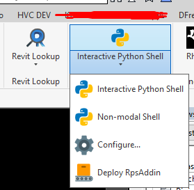
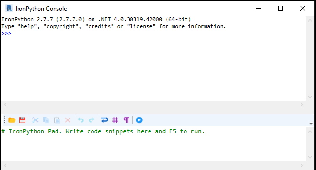
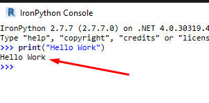
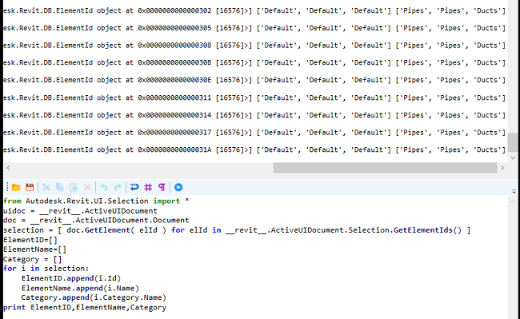

Chào mừng các bác đã ghé thăm blog của mình.😄

### Đây là cái gì ?
 RevitPythonShell(RPS) cơ bản chính là một tiện ích nhỏ trong Revit cho phép mình viết các plugin bằng ngôn ngữ **Python**.Tuyệt vời hơn là nó cho phép mình xem ngay kết quả sau khi vừa gõ mã xong, đó cũng chính là cái điểm mạnh của RPS, nếu như mình kết hợp thêm với <a href="https://github.com/jeremytammik/RevitLookup" target="_blank">RevitLookup</a> nữa thì chả khác nào hồ mọc thêm cọng long cánh với Revit API.
 
---
### Cài đặt như thế nào ?
Cũng như mọi addin cài vào Revit mà thôi, bản cài đặt exe đó các bác, link tải về mình để ở dưới đây :

<a href="data/2017.03.07_Setup_RevitPythonShell_2016.exe" target="_blank">Autodesk Revit 2016</a>

<a href="data/2017.04.06_Setup_RevitPythonShell_2017.exe" target="_blank">Autodesk Revit 2017</a>

<a href="data/2017.07.24_Setup_RevitPythonShell_2018.exe" target="_blank">Autodesk Revit 2018</a>

<a href="data/2018.09.19_Setup_RevitPythonShell_2019.exe" target="_blank">Autodesk Revit 2019</a>

<a href="data/2020.01.19_Setup_RevitPythonShell_2020.exe" target="_blank">Autodesk Revit 2020</a>     

Sau khi cài đặt thành công trong tab Ribbon của Revit các bác sẽ dễ dàng nhìn thấy một cái gì đó màu vàng vàng như thế này, chính là hắn đấy.😎



### Sử dụng và viết mã

Được rồi, lỡ cài rồi thì mình thử vọc vạch xem như thế nào rồi gỡ cũng chưa muộn mà, thử mở cái đầu tiên với cái tên `Interactive Python Shell` lên thử.



Trông cũng sịn sò phết, thử gõ vài dòng xin chào thế giới xem 



Đù, gõ cái ra kết quả luôn kìa, ghê gớm chưa haha, đi khoe với vợ thôi  🤣 

Mình thử can thiệp vào Element trong Revit với vài dòng code cơ bản xem sao, nhấn nút Run để chạy thử nhé.

```
from Autodesk.Revit.UI.Selection import *
uidoc = __revit__.ActiveUIDocument
doc = __revit__.ActiveUIDocument.Document
selection = [ doc.GetElement( elId ) for elId in __revit__.ActiveUIDocument.Selection.GetElementIds() ]
ElementID=[]
ElementName=[]
Category = []
for i in selection:
    ElementID.append(i.Id)
    ElementName.append(i.Name)
    Category.append(i.Category.Name)    
print ElementID,ElementName,Category
```
Kết quả 



Nếu các bác mới gõ tới đây mà la làng thì nên học tiếp nha, mọi chuyện không dễ dàng thế đâu.😎
Đề triển khai ý tưởng của các bác hoặc kiểm thử thì rất có ích đó chứ, mình có để lại tài liệu bên dưới cho bác nào muốn học thêm hoặc học cho biết, lỡ đâu trong quá trình tìm hiểu các bác lại ngộ ra điều gì thì sao. 😍

- Thông tin thêm : Hiện tại có thử viện **Revit Python Wrapper** đã ngắn nay lại còn ngắn hơn nữa, các bác thử tìm hiểu và code xem sao nhé ! Link mình để ở <a href="https://revitpythonwrapper.readthedocs.io/en/latest/index.html" target="_blank">Đây</a>.

### Tổng kết

Vậy là mình đã kể cho các bác nghe xong hết câu chuyện nữa rồi đó, cứ thấy gì đó vui vui hay hay là mình lại viết lên cho a e tham khảo và góp ý, nếu có ý tưởng gì giúp cải thiện nhanh hơn thì các bác bình luận bên dưới nhé, mình sẽ bổ sung để bài viết được hoàn thiện hơn.Cám ơn các bác đã ghé thăm blog của mình !

### Tham khảo :

<a href="https://github.com/architecture-building-systems/revitpythonshell" target="_blank">RevitPythonShell</a>

<a href="https://daren-thomas.gitbooks.io/scripting-autodesk-revit-with-revitpythonshell/content/" target="_blank">Scripting-Autodesk-Revit-With-Revitpythonshell</a> 

<a href="http://thebuildingcoder.typepad.com/files/cp3837-l_scripting_revitpythonshell_handout.pdf" target="_blank">Scripting_RevitPythonShell_Handout</a>

<a href="https://stackoverflow.com/questions/54325392/modify-selection-to-first-element-by-selection-setelementids" target="_blank">Selection Element Revit API</a> 

<a href="https://revitpythonwrapper.readthedocs.io/en/latest/index.html" target="_blank">Revit Python Wrapper</a>  